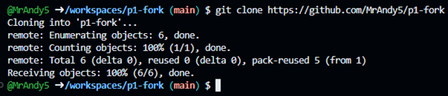
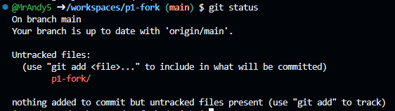
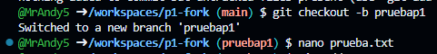
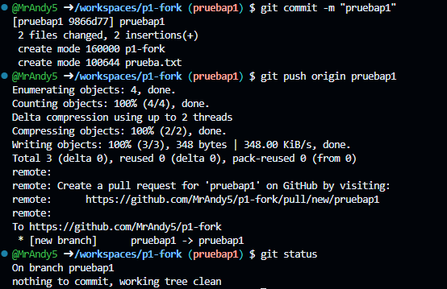
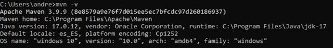
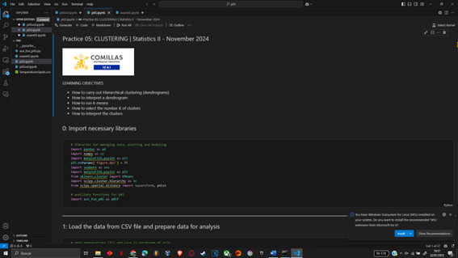
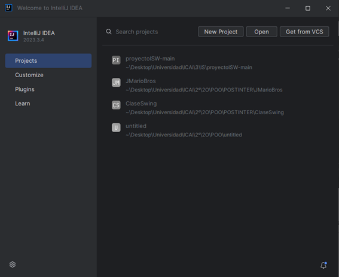

# Programación de Aplicaciones Telemáticas

## Práctica 1: Entorno de Desarrollo

Autor: Andrés Sánchez de Ágreda

### Contenido

1. [Entorno de Desarrollo](#entorno-de-desarrollo)
2. [Git y GitHub](#git-y-github)
3. [Entorno de Desarrollo Java](#entorno-de-desarrollo-java)
4. [Conclusión](#conclusion)

---

### Entorno de Desarrollo

Esta práctica tiene como objetivo familiarizarse con el entorno de desarrollo necesario para la asignatura, incluyendo el uso de herramientas como Git, GitHub y un entorno de desarrollo Java.

---

### Git y GitHub

Durante la introducción a la asignatura se realizó un fork del repositorio original. A continuación, se detallan los pasos realizados:

1. **Clonado del Repositorio:**
   - Se utilizó el comando `git clone` para clonar el repositorio `p1-fork` a un codespace.
     
   
   
   - Después de ejecutar el comando `git status`, se confirmó que el repositorio estaba actualizado con respecto a la rama principal (`main`).

   

3. **Creación de una Branch:**
   - Se creó una nueva branch en el repositorio.
  
   
     
   - Se realizaron cambios en esta branch y se subieron al repositorio en la nube usando los comandos necesarios de Git.

   

   - Por último, para subir las imágenes del código se utilizó el comando git add files.
---

### Entorno de Desarrollo Java

Dado que en el cuatrimestre anterior cursé Ingeniería de Software, ya tenía configurado todo el entorno de desarrollo necesario para Java. Esto incluye:

- **Maven y Java 17:**
  - Confirmado mediante el comando `mvn -v`, el cual mostró las versiones instaladas.

    

- **Editores de Código:**
  - Instalación de Visual Studio Code (VSCode) y IntelliJ IDEA Community Edition.
 
    

    

---

### Conclusión

En este informe se ha intentado ser lo más conciso posible, ya que previamente he adquirido experiencia con Git, GitHub y el desarrollo en Java durante el cuatrimestre anterior.

## ¿Cómo escribir un README.md con formato?

[Github Markdown](https://docs.github.com/es/get-started/writing-on-github/getting-started-with-writing-and-formatting-on-github/basic-writing-and-formatting-syntax)
